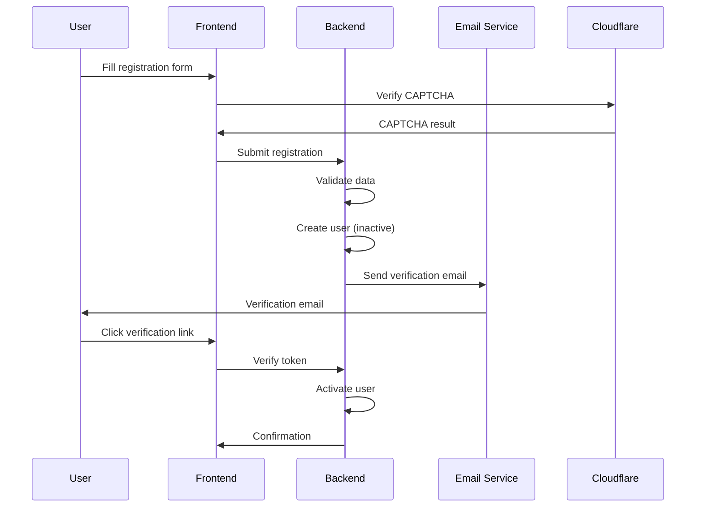
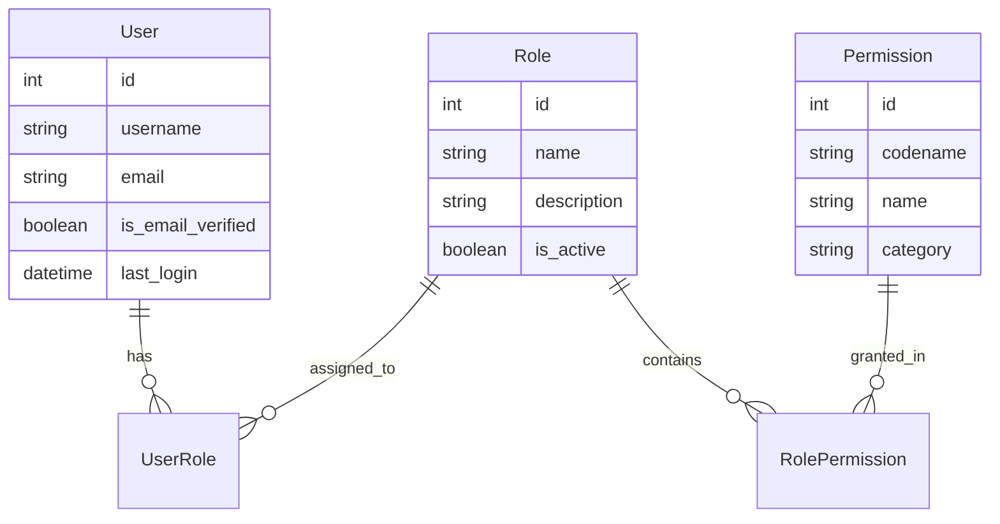

# Advanced Authentication System Design Document

## Overview

El sistema de autenticación avanzada proporcionará registro con verificación por email, perfiles personalizables con avatares, sistema de roles granular, recuperación segura de contraseñas y protección CAPTCHA con Cloudflare Turnstile.

## Architecture

### Backend Architecture (Django)

```
authentication/
├── models.py              # User, Profile, Role, Permission models
├── serializers.py         # DRF serializers for API
├── views.py              # Authentication views
├── permissions.py        # Custom permission classes
├── signals.py            # User creation signals
├── tasks.py              # Celery tasks for emails
├── utils.py              # Utility functions
└── tests.py              # Comprehensive tests

users/
├── models.py              # Extended user models
├── views.py              # Profile management views
├── serializers.py        # Profile serializers
└── admin.py              # Admin interface
```

### Frontend Architecture (Nuxt 3)

```
pages/
├── auth/
│   ├── register.vue       # Registration with CAPTCHA
│   ├── verify-email.vue   # Email verification
│   ├── forgot-password.vue # Password reset request
│   └── reset-password.vue # Password reset form
├── profile/
│   ├── index.vue          # Profile view
│   ├── edit.vue           # Profile editing
│   └── settings.vue       # Privacy settings
└── admin/
    └── users/
        ├── index.vue      # User management
        └── roles.vue      # Role management

components/
├── Auth/
│   ├── RegisterForm.vue   # Registration form
│   ├── CaptchaWidget.vue  # Turnstile integration
│   └── PasswordStrength.vue # Password validation
├── Profile/
│   ├── AvatarUpload.vue   # Avatar management
│   ├── ProfileForm.vue    # Profile editing
│   └── PrivacySettings.vue # Privacy controls
└── Admin/
    ├── UserTable.vue      # User management table
    └── RoleEditor.vue     # Role permission editor
```

## Components and Interfaces

### Backend Models

#### Extended User Model
```python
class User(AbstractUser):
    email = models.EmailField(unique=True)
    is_email_verified = models.BooleanField(default=False)
    email_verification_token = models.CharField(max_length=255, blank=True)
    email_verification_sent_at = models.DateTimeField(null=True, blank=True)
    last_password_change = models.DateTimeField(auto_now_add=True)
    failed_login_attempts = models.IntegerField(default=0)
    locked_until = models.DateTimeField(null=True, blank=True)
    
    USERNAME_FIELD = 'email'
    REQUIRED_FIELDS = ['username']
```

#### User Profile Model
```python
class UserProfile(models.Model):
    user = models.OneToOneField(User, on_delete=models.CASCADE, related_name='profile')
    avatar = models.ImageField(upload_to='avatars/', blank=True, null=True)
    bio = models.TextField(max_length=500, blank=True)
    location = models.CharField(max_length=100, blank=True)
    website = models.URLField(blank=True)
    birth_date = models.DateField(null=True, blank=True)
    
    # Privacy settings
    show_email = models.BooleanField(default=False)
    show_location = models.BooleanField(default=True)
    show_birth_date = models.BooleanField(default=False)
    allow_follow = models.BooleanField(default=True)
```

#### Role and Permission System
```python
class Role(models.Model):
    name = models.CharField(max_length=50, unique=True)
    description = models.TextField(blank=True)
    is_active = models.BooleanField(default=True)
    created_at = models.DateTimeField(auto_now_add=True)

class Permission(models.Model):
    codename = models.CharField(max_length=100, unique=True)
    name = models.CharField(max_length=255)
    description = models.TextField(blank=True)
    category = models.CharField(max_length=50)

class RolePermission(models.Model):
    role = models.ForeignKey(Role, on_delete=models.CASCADE)
    permission = models.ForeignKey(Permission, on_delete=models.CASCADE)
    granted = models.BooleanField(default=True)

class UserRole(models.Model):
    user = models.ForeignKey(User, on_delete=models.CASCADE)
    role = models.ForeignKey(Role, on_delete=models.CASCADE)
    assigned_at = models.DateTimeField(auto_now_add=True)
    assigned_by = models.ForeignKey(User, on_delete=models.SET_NULL, null=True, related_name='assigned_roles')
```

#### Security Audit Log
```python
class SecurityAuditLog(models.Model):
    user = models.ForeignKey(User, on_delete=models.SET_NULL, null=True)
    action = models.CharField(max_length=100)
    ip_address = models.GenericIPAddressField()
    user_agent = models.TextField()
    success = models.BooleanField()
    details = models.JSONField(default=dict)
    timestamp = models.DateTimeField(auto_now_add=True)
```

### API Endpoints

#### Authentication Endpoints
```python
# Registration with email verification
POST /api/v1/auth/register/
{
    "username": "string",
    "email": "string",
    "password": "string",
    "password_confirm": "string",
    "captcha_token": "string"
}

# Email verification
POST /api/v1/auth/verify-email/
{
    "token": "string"
}

# Password reset request
POST /api/v1/auth/forgot-password/
{
    "email": "string",
    "captcha_token": "string"
}

# Password reset confirmation
POST /api/v1/auth/reset-password/
{
    "token": "string",
    "new_password": "string",
    "password_confirm": "string"
}
```

#### Profile Management Endpoints
```python
# Get user profile
GET /api/v1/users/profile/

# Update profile
PATCH /api/v1/users/profile/
{
    "bio": "string",
    "location": "string",
    "website": "string",
    "privacy_settings": {
        "show_email": boolean,
        "show_location": boolean,
        "allow_follow": boolean
    }
}

# Upload avatar
POST /api/v1/users/avatar/
Content-Type: multipart/form-data
```

### Frontend Components

#### Registration Form with CAPTCHA
```vue
<template>
  <form @submit.prevent="handleRegister">
    <input v-model="form.username" type="text" required />
    <input v-model="form.email" type="email" required />
    <input v-model="form.password" type="password" required />
    <PasswordStrength :password="form.password" />
    <CaptchaWidget @verified="handleCaptcha" />
    <button type="submit" :disabled="!captchaVerified">Registrarse</button>
  </form>
</template>
```

#### Avatar Upload Component
```vue
<template>
  <div class="avatar-upload">
    <div class="avatar-preview">
      
      <button @click="triggerUpload" class="upload-btn">
        <Icon name="camera" />
      </button>
    </div>
    <input ref="fileInput" type="file" @change="handleUpload" accept="image/*" hidden />
  </div>
</template>
```

## Data Models

### User Registration Flow


### Role Permission System


## Error Handling

### Frontend Error Handling
```typescript
// Composable for auth errors
export const useAuthErrors = () => {
  const handleAuthError = (error: any) => {
    const errorMap = {
      'email_not_verified': 'Por favor verifica tu email antes de continuar',
      'invalid_captcha': 'CAPTCHA inválido, por favor intenta de nuevo',
      'account_locked': 'Cuenta bloqueada por múltiples intentos fallidos',
      'weak_password': 'La contraseña no cumple con los requisitos de seguridad'
    }
    
    return errorMap[error.code] || error.message || 'Error desconocido'
  }
  
  return { handleAuthError }
}
```

### Backend Error Responses
```python
# Standardized error responses
{
    "error": true,
    "code": "email_not_verified",
    "message": "Email verification required",
    "details": {
        "field": "email",
        "verification_sent": true
    }
}
```

## Testing Strategy

### Backend Tests
```python
class AuthenticationTestCase(APITestCase):
    def test_registration_with_captcha(self):
        """Test user registration with CAPTCHA validation"""
        
    def test_email_verification_flow(self):
        """Test complete email verification process"""
        
    def test_password_reset_security(self):
        """Test password reset token security"""
        
    def test_role_permission_enforcement(self):
        """Test granular permission checking"""
```

### Frontend Tests
```typescript
describe('Registration Flow', () => {
  it('should require CAPTCHA completion', async () => {
    // Test CAPTCHA requirement
  })
  
  it('should validate password strength', async () => {
    // Test password validation
  })
  
  it('should handle email verification', async () => {
    // Test verification flow
  })
})
```

## Security Considerations

### Password Security
- Minimum 8 characters with complexity requirements
- Password strength meter with real-time feedback
- Bcrypt hashing with high cost factor
- Password history to prevent reuse

### Email Verification
- Cryptographically secure tokens
- Token expiration (24 hours)
- Rate limiting for verification requests
- Secure email templates

### CAPTCHA Integration
- Cloudflare Turnstile for bot protection
- Invisible CAPTCHA when possible
- Fallback to challenge when needed
- Rate limiting integration

### Account Security
- Account lockout after failed attempts
- IP-based rate limiting
- Security audit logging
- Suspicious activity detection

## Performance Optimization

### Database Optimization
- Indexes on frequently queried fields
- Efficient role permission queries
- Connection pooling
- Query optimization

### Frontend Performance
- Lazy loading of profile components
- Image optimization for avatars
- Efficient state management
- Progressive enhancement

### Caching Strategy
- Redis for session storage
- Permission caching
- Avatar image caching
- Rate limiting counters