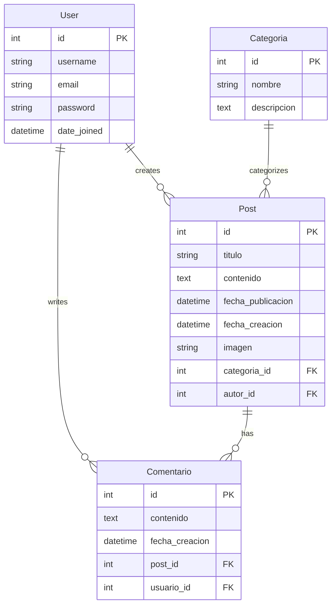

# Design Document

## Overview

El blog de noticias Django será una aplicación web que sigue el patrón MVT (Model-View-Template) de Django. La aplicación constará de múltiples apps Django para organizar la funcionalidad: una app principal para posts, otra para gestión de usuarios, y utilizará el sistema de autenticación integrado de Django.

## Architecture

### Project Structure
```
django_blog/
├── manage.py
├── django_blog/
│   ├── __init__.py
│   ├── settings.py
│   ├── urls.py
│   └── wsgi.py
├── posts/
│   ├── models.py
│   ├── views.py
│   ├── urls.py
│   ├── forms.py
│   ├── admin.py
│   └── templates/posts/
├── users/
│   ├── views.py
│   ├── urls.py
│   ├── forms.py
│   └── templates/users/
├── static/
│   ├── css/
│   ├── js/
│   └── images/
├── media/
│   └── posts/
└── templates/
    └── base.html
```

### Apps Organization
- **posts**: Maneja toda la funcionalidad relacionada con artículos, categorías y comentarios
- **users**: Gestiona registro, login, logout y restablecimiento de contraseñas
- **django.contrib.admin**: Panel de administración integrado de Django

## Components and Interfaces

### Models (posts/models.py)

#### Categoria Model
```python
class Categoria(models.Model):
    nombre = models.CharField(max_length=100, unique=True)
    descripcion = models.TextField(blank=True)
    
    def __str__(self):
        return self.nombre
    
    class Meta:
        verbose_name_plural = "Categorías"
```

#### Post Model
```python
class Post(models.Model):
    titulo = models.CharField(max_length=200)
    contenido = models.TextField()
    fecha_publicacion = models.DateTimeField(default=timezone.now)
    fecha_creacion = models.DateTimeField(auto_now_add=True)
    imagen = models.ImageField(upload_to='posts/', null=True, blank=True)
    categoria = models.ForeignKey(Categoria, on_delete=models.SET_NULL, null=True)
    autor = models.ForeignKey(User, on_delete=models.CASCADE)
    
    def __str__(self):
        return self.titulo
    
    class Meta:
        ordering = ['-fecha_publicacion']
```

#### Comentario Model
```python
class Comentario(models.Model):
    post = models.ForeignKey(Post, on_delete=models.CASCADE, related_name='comentarios')
    usuario = models.ForeignKey(User, on_delete=models.CASCADE)
    contenido = models.TextField()
    fecha_creacion = models.DateTimeField(auto_now_add=True)
    
    def __str__(self):
        return f'Comentario de {self.usuario.username} en {self.post.titulo}'
    
    class Meta:
        ordering = ['fecha_creacion']
```

### Views Architecture

#### Class-Based Views (CBV)
- **PostListView**: ListView para mostrar todos los posts con paginación
- **PostDetailView**: DetailView para mostrar un post específico con comentarios
- **PostByCategoryView**: ListView filtrada por categoría

#### Function-Based Views (FBV)
- **add_comment**: Vista para procesar formularios de comentarios
- **user_register**: Vista personalizada para registro de usuarios
- **password_reset_views**: Vistas para el flujo de restablecimiento de contraseña

### URL Patterns

#### Main URLs (django_blog/urls.py)
```python
urlpatterns = [
    path('admin/', admin.site.urls),
    path('', include('posts.urls')),
    path('users/', include('users.urls')),
]
```

#### Posts URLs (posts/urls.py)
```python
urlpatterns = [
    path('', PostListView.as_view(), name='home'),
    path('post/<int:pk>/', PostDetailView.as_view(), name='post_detail'),
    path('categoria/<int:categoria_id>/', PostByCategoryView.as_view(), name='posts_by_category'),
    path('post/<int:pk>/comment/', add_comment, name='add_comment'),
]
```

#### Users URLs (users/urls.py)
```python
urlpatterns = [
    path('register/', user_register, name='register'),
    path('login/', LoginView.as_view(), name='login'),
    path('logout/', LogoutView.as_view(), name='logout'),
    path('password-reset/', PasswordResetView.as_view(), name='password_reset'),
    # ... más URLs para el flujo completo de password reset
]
```

## Data Models

### Database Schema


### ORM Relationships
- **User to Post**: One-to-Many (un usuario puede crear múltiples posts)
- **Categoria to Post**: One-to-Many (una categoría puede tener múltiples posts)
- **Post to Comentario**: One-to-Many (un post puede tener múltiples comentarios)
- **User to Comentario**: One-to-Many (un usuario puede escribir múltiples comentarios)

## Error Handling

### Form Validation
- **User Registration**: Validación de username único, email válido, contraseñas coincidentes
- **Comment Form**: Validación de contenido no vacío, usuario autenticado
- **Admin Forms**: Validación de campos requeridos en posts y categorías

### Error Pages
- **404.html**: Página no encontrada
- **500.html**: Error interno del servidor
- **403.html**: Acceso denegado

### Exception Handling
```python
# En views.py
from django.shortcuts import get_object_or_404

def post_detail(request, pk):
    post = get_object_or_404(Post, pk=pk)
    # ... resto de la lógica
```

## Testing Strategy

### Unit Tests
- **Model Tests**: Validar creación, relaciones y métodos de modelos
- **Form Tests**: Validar formularios de registro, login y comentarios
- **View Tests**: Validar respuestas HTTP, contexto y templates

### Integration Tests
- **User Flow Tests**: Registro → Login → Comentar → Logout
- **Admin Tests**: Crear posts y categorías desde el admin
- **URL Tests**: Validar que todas las URLs respondan correctamente

### Test Structure
```python
# tests/test_models.py
class PostModelTest(TestCase):
    def test_post_creation(self):
        # Test post creation
    
    def test_post_str_method(self):
        # Test __str__ method

# tests/test_views.py
class PostViewTest(TestCase):
    def test_post_list_view(self):
        # Test list view
    
    def test_post_detail_view(self):
        # Test detail view
```

### Template System

#### Base Template Structure
```html
<!-- templates/base.html -->
<!DOCTYPE html>
<html>
<head>
    <title>Blog de Noticias</title>
    
    <link rel="stylesheet" href="">
</head>
<body>
    <nav>
        <!-- Navigation menu -->
    </nav>
    
    <main>
        
        
    </main>
    
    <footer>
        <!-- Footer content -->
    </footer>
</body>
</html>
```

#### Template Inheritance
- **base.html**: Template principal con estructura común
- **posts/list.html**: Extiende base.html para mostrar lista de posts
- **posts/detail.html**: Extiende base.html para mostrar detalle de post
- **users/register.html**: Extiende base.html para formulario de registro

### Static Files Management
- **CSS**: Estilos personalizados en static/css/
- **JavaScript**: Funcionalidad interactiva en static/js/
- **Images**: Imágenes del sitio en static/images/
- **Media**: Archivos subidos por usuarios en media/

### Security Considerations
- **CSRF Protection**: Habilitado por defecto en Django
- **SQL Injection**: Prevención automática con ORM
- **XSS Protection**: Escape automático en templates
- **Authentication**: Sistema integrado de Django con hash seguro de contraseñas
- **File Upload**: Validación de tipos de archivo para imágenes

### Performance Optimization
- **Database Queries**: Uso de select_related() y prefetch_related()
- **Pagination**: Implementación en listas de posts
- **Static Files**: Configuración para servir archivos estáticos eficientemente
- **Caching**: Preparado para implementar cache de Django si es necesario